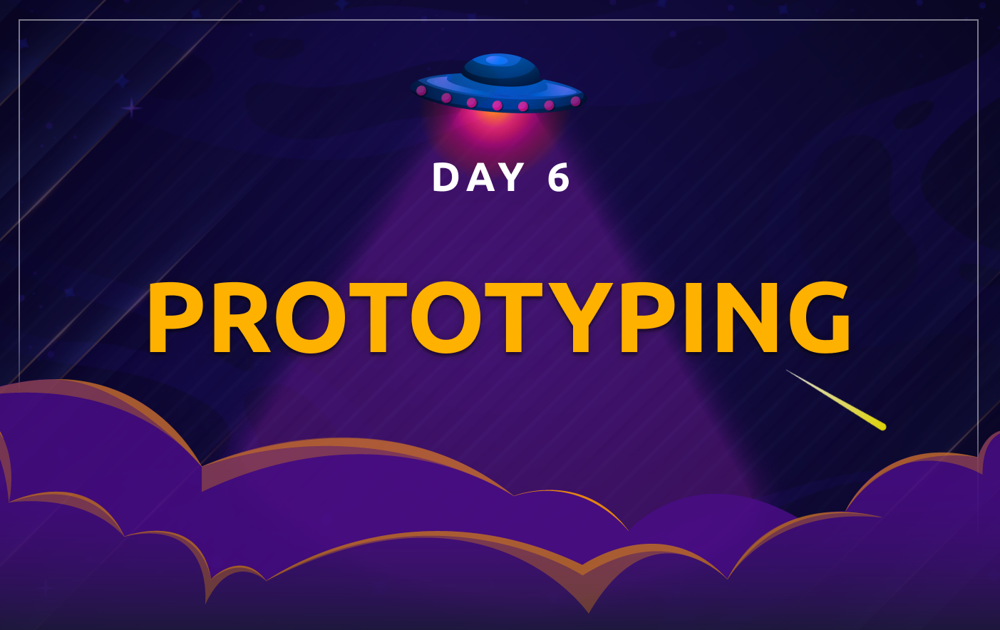
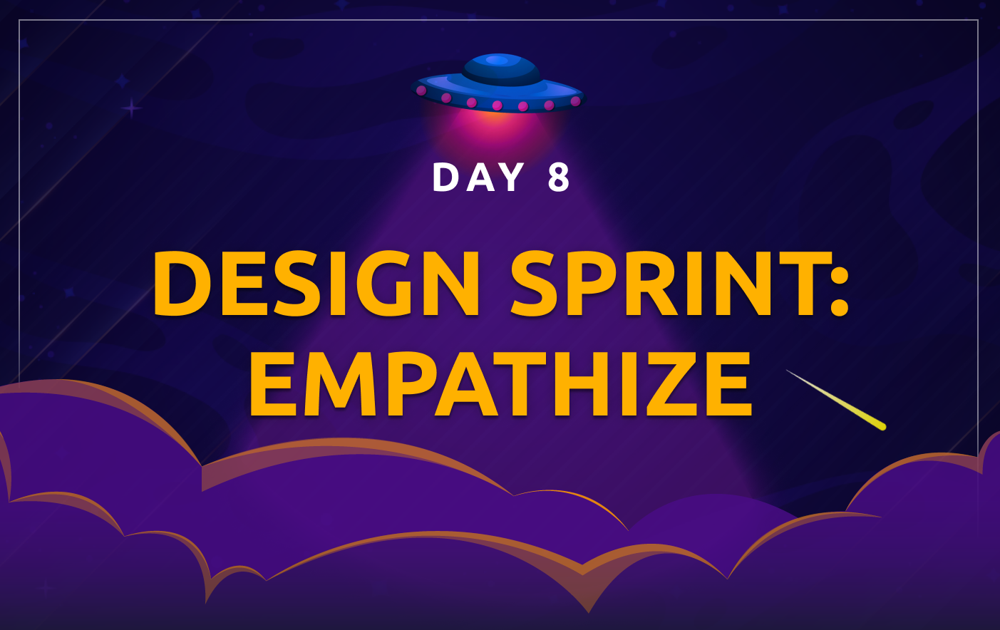
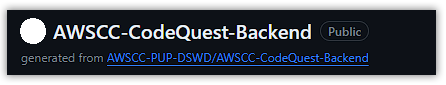

<h1 align="center">🚀 30 Days of UI/UX 🚀</h1>

Welcome to **30 Days of UI/UX**! 🚀 Get ready for a month-long journey into the fascinating realm of UI/UX design and Figma fun! Whether you're a design pro 🎨 or just starting out 🤓, this adventure aims to demystify web design without overwhelming you with intricate terminology. We'll keep it straightforward and hands-on.

So, are you prepared to dive into this 30-day design party with us? Let's embark on this journey together 🌈💻, transforming each day into an opportunity to enhance your design prowess and craft visually stunning digital experiences. Get ready for a month filled with inspiration, creativity, and the satisfaction of mastering the art of web design! 🚀✨

---

### 👀 What's Inside It

This repository contains the following **main** folders:

1. [**ui-ux folder**](ui-ux/README.md): main folder where the workshop will take place. In here you will see files that contains the tutorials and activites assigned for each day.
    - [**week-1-2 folder**](ux/week-1-2/README.md): contains the markdown files for **day 1-22**, with day 1-11 serving as exercises and days 12-14 as the required project. 
    - [**week-3 folder**](ui-ux/week-3/README.md): contains the markdown files for **day 15-22**, representing one of the required projects. 
    - [**week-4 folder**](ui-ux/week-4/README.md): contains the markdown files for **day 23-30**, representing one of the required projects. 

2. [**submissions folder**](submissions/README.md): contains markdown files that participants will modify to include their outputs or figma links. 
    - [**exercises subfolder**](submissions/exercises): for daily activities with the purpose of practicing what you've learned, which are **not required** for the certificate of completion but is **advisable to complete** them.
    - [**final-projects subfolder**](submissions/final-projects/): for final projects, which are **required** for the certificate of completion. 

> [!IMPORTANT]
> Take your time to read the README files in these folders for important instructions and a handy outline to guide you.

 

---

### 📅 ┊ Table of Contents  

| | | | | |
| - | - | - | - | - |
|
<h4 align='center'><a href='ui-ux/week-1-2/day01.md'>Introduction  to UI/UX</a></h4>
 |
<h4 align='center'><a href='ui-ux/week-1-2/day02.md'>Figma Basics</a></h4>
 |
<h4 align='center'><a href='ui-ux/week-1-2/day03.md'>Design  Principles</a></h4>
 |
<h4 align='center'><a href='ui-ux/week-1-2/day04.md'>Design  Components</a></h4>
 |
<h4 align='center'><a href='ui-ux/week-1-2/day05.md'>Figma Advance</a></h4>
 
|
<h4 align='center'><a href='ui-ux/week-1-2/day06.md'>Prototyping</a></h4>
 |
<h4 align='center'><a href='ui-ux/week-1-2/day07.md'>Low-Fidelity  Wireframe</a></h4>
 |
<h4 align='center'><a href='ui-ux/week-1-2/day08.md'>Design Sprint:  Empathize</a></h4>
 |
<h4 align='center'><a href='ui-ux/week-1-2/day09.md'>Design Sprint:  Define</a></h4>
 |
<h4 align='center'><a href='ui-ux/week-1-2/day10.md'>Competitor Analysis</a></h4>
 |
|
<h4 align='center'><a href='ui-ux/week-1-2/day11.md'>Design Sprint: Ideate</a></h4>
 |
<h4 align='center'><a href='ui-ux/week-1-2/day12-14.md'>Lo-Fi Wireframe  Website [Project]</a></h4>
 |
<h4 align='center'><a href='ui-ux/week-3/README.md'>Hi-Fi Wireframe  Website [Project]</a></h4>
 |
<h4 align='center'><a href='ui-ux/week-4/README.md'>Hi-Fi Wireframe  Mobile [Project]</a></h4>
 |

---

### ✉️ Submissions

**CodeQuest** is made to provide participants an immersive, hands-on coding experience by guiding them through the creation of small projects. Every day of CodeQuest contains a particular knowledge that is essential to build the foundations of your web development skills.

When we talk about **UI/UX at CodeQuest**, **we're switching gears a bit**. Instead of diving into complex coding, we're going hands-on with the creative side of things. Imagine using cool tools like Figma to shape how websites and apps look and feel—without getting into the nitty-gritty of code. These sessions are all about letting your creativity flow, refining designs, and understanding how to make things user-friendly. It's a chance to see how the visual and functional aspects come together in the digital world, creating awesome projects without the need for heavy coding!

We encourage you to share your progress in [📈┊codequest-progress](https://discord.com/channels/1106592546815225878/1175409781540925521) to serve as motivation for others and to open up discussions and reviews to gain further insights about a particular topic.

>*example*:
>
>**Day**: 02 of UI/UX
>
>**Topic**: Figma Basics
>
>**Highlights**:
>- Learned how to navigate its interface
>- Built a nice layout for Alf's Shop
> 
>**Attachments**: _attached a screenshot of the final activity_(optional)

To finish our **CodeQuest: 30 Days of UI/UX**, you need to submit **3** projects for your completion to be acknowledged and for you to get the **CERTIFICATE**:

    .
    ├── submissions
    │   ├── ...
    │   ├── final-projects  
    │   └── ...  ├── day12-14.md  # lo-fi wireframe layout
    └── ...      ├── day15-22.md  # website hi-fi wireframe
                 └── day23-30.md  # mobile hi-fi wireframe

> Note: Daily lessons may not be mandatory, and submitting daily exercises/challenges is optional, but it is highly encouraged to complete them in order to learn effectively and track your progress each day until the end of the 30-day period.

 

---

### 💫 Getting Started

Use this template to create your own repository with existing directory structure and files to participate in our **CodeQuest: 30 Days of UI/UX**.

1. On GitHub.com, navigate to the main page of this repository and click the **`Use this template`** button.

    

2. Name it with the same name as this repository (*AWSCC-CodeQuest-UI-UX*), and make it **public**.
   > ***NOTE***: The repository name should be in the format of **AWSCC-CodeQuest-UI-UX** (Do not copy exactly the same name as in the image below) 

   

3. On the lower right, click **`Create repository`**.

    

   and it should generate the repository in your account.

   > ***NOTE***: The repository name should be in the format of **AWSCC-CodeQuest-UI-UX** (Do not copy exactly the same name as in the image below) 

    

4. After creating a repository, copy the repository URL and paste it in our **[CodeQuest Tracker Sheet](https://docs.google.com/spreadsheets/d/1OsXL63ei1HblY7-gXD8uMbSoWdZJlD02mTbrjvcSsNo/edit#gid=0)** in your corresponding row.

    > Note: If you are having trouble with the CodeQuest Tracker Sheet, do not hesitate to directly message any DSWD officers or email us at awscloudclub.pupmnl.dswd@gmail.com

5. Finally, clone the repository by clicking the **`Code`** button on the top right side of the repository's main page and clicking the **`Open with GitHub Desktop`** button to redirect to your GitHub Desktop application.

    

6. And just click the **`Clone`** button to clone it to your computer.

    

 

---
## 🌟 Contributors

<!-- ALL-CONTRIBUTORS-LIST:START - Do not remove or modify this section -->
| <a href='https://github.com/xialuna'><h4 align='center'><a href='https://github.com/xialuna'>Xian Cheng</a></h4> | <a href='https://github.com/xmuwisa'><h4 align='center'><a href='https://github.com/xmuwisa'>Luisa Eustaquio</a></h4> | <a href='https://github.com/akhimverona'><h4 align='center'><a href='https://github.com/akhimverona'>Khim Verona</a></h4> | <a href='https://github.com/eimikiii'><h4 align='center'><a href='https://github.com/eimikiii'>Mikyla Angala</a></h4> |
| :---: | :---: | :---: | :---: |
<!-- ALL-CONTRIBUTORS-LIST:END -->

---
 

<h1 align='center'>Enjoy designing!~</h1>
