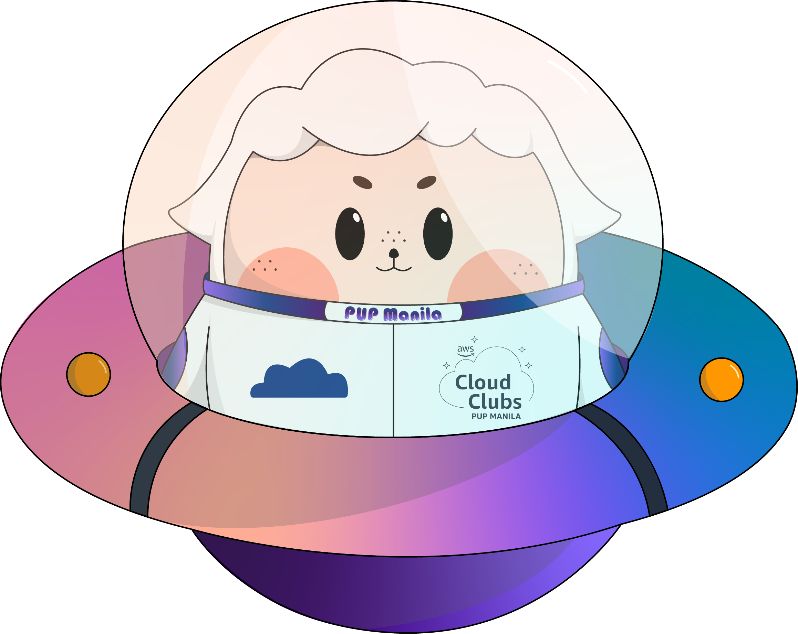

## Hello there, my fellow Alfbuddy! 💖

You've made it—great job! Now, here's the scoop: this markdown file is your **canvas**. Customize it; let your creativity flow!

Remember, you're free to add your personal touch, but keep the sacred requirements intact; they are the guardians of order here. This markdown file should or may include:

#### 1. UI and UX analyses for Day 1

_(just choose the questions you would like to answer and make it concise)_
  
&nbsp;&nbsp;&nbsp;&nbsp;**User-Experience Analysis:** 

-   Which website is easier to find the product you are looking for? 
    Answer:

-   Identify any distractions or unnecessary elements that could potentially confuse users. 
    Answer:

-   Compare the organization of content between the two platforms. Which between the two platforms’ content is easier to scan and understand? 
    Answer:

  &nbsp;&nbsp;&nbsp;&nbsp;**User-Interface Analysis:**

-   Is the websites’ layout and design visually pleasing and consistent with their brand? 
    Answer:
    
-   Comment on the responsiveness of both websites across different devices. 
    Answer:
    
-   Which do you think is better when it comes to the visual aspect of the website? 
    Answer:
    
     

#### 2. An **optional** screenshot of playing the game **"It's Centred That"** and your feedback

 Ready to include your output for **Day 1**? Let the customization begin! 🚀✨

<!-- You may now delete and modify the content of this file -->
