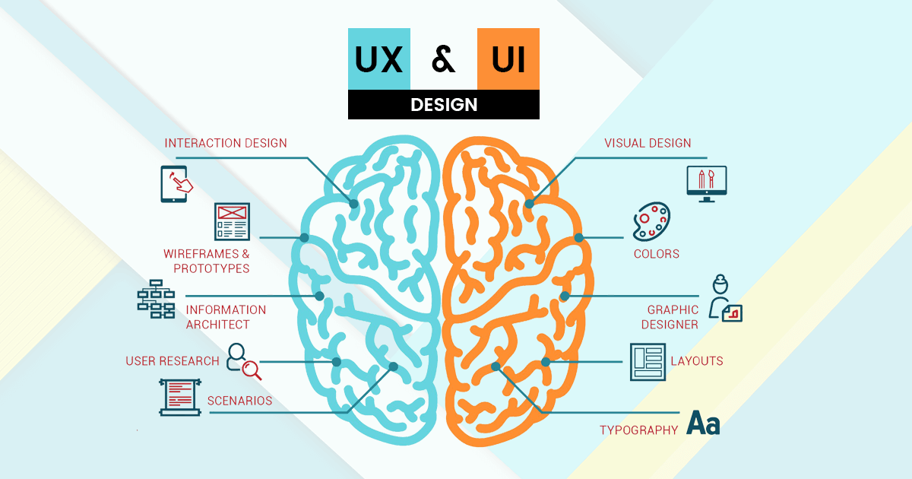
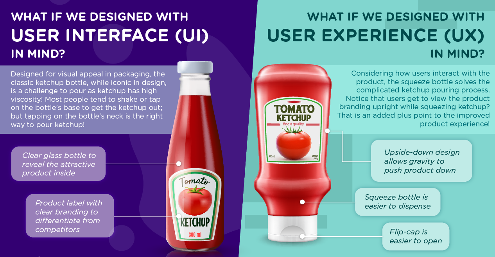

**<h1 align="center"> DAY 1: Introduction to UI/UX Design </h1>**
**_Ever catch yourself wondering about UI and UX design—what's the deal, and why does it matter?_**

### **User Interface [UI]**

Ever notice how some apps just look sleek and enticing? That's UI at work—the color palette, buttons, and overall aesthetics that make the website/app looks visually appealing.

### **User Experience[UX]**

Now, **UX** is the complete experience of a user after using the product. It cares about how easy it is to navigate the app, whether buttons make sense, and if the overall experience makes you happy. And answers the ff. questioons:

    - Who they are designing for?
    - What are the users’ needs that must be fulfilled?
    - Does the (digital) product meet these needs?

#### Example in real life: UI VS. UX
  

> **_Learn More:_** [_Introduction to UX and UI Design_](https://bootcamp.uxdesign.cc/basic-introduction-to-user-experience-and-user-interface-design-f0aae08a2b44)

##

## **About the Challenge:**

#### **🖥️ Introduction to UI/UX using real-life websites**

The challenge is to really get the hang of why certain colors and buttons are chosen, and how to judge if a website or app is easy and enjoyable to use.

The main goals here are to get better at recognizing good design, understanding how users interact with digital stuff, and figuring out ways to make designs even better.

### Situation:

You're a **USER** who is NOT familiar in navigating websites but is curious on how they work. As you click around, you explored on how buttons and icons either makes navigatin the website easy or a bit confusing. You're not trying to become an expert; you just want to figure out why some websites feel like a smooth ride while others are a bit bumpy.

In your quest to understand, you decide to take a closer look at the design choices of two widely used e-commerce platforms: Shopee and Lazada.

### ✅ To-Do List

    ☐ Navigate the interface of the sites mentioned
    ☐ Reflect on how design choices impact user's perception of a website

### 📋 Instructions

Visit both Shopee and Lazada's web and mobile applications. Explore their homepages, analyze interface designs, and document your experiences.  
&nbsp;&nbsp;&nbsp;&nbsp;**User-Experience Analysis:** 

-   Which website is easier to find the product you are looking for?
-   Identify any distractions or unnecessary elements that could potentially confuse users.
-   Compare the organization of content between the two platforms. Which between the two platforms’ content is easier to scan and understand? 
     

&nbsp;&nbsp;&nbsp;&nbsp;**User-Interface Analysis:**

-   Is the websites’ layout and design visually pleasing and consistent with their brand?
-   Comment on the responsiveness of both websites across different devices.
-   Which do you think is better when it comes to the visual aspect of the website?
      

### Show off your work!

Submit your work here: <a href="../../submissions/exercises/day01.md" target="_blank">../../submissions/exercises/day01.md</a>

Share your UI and UX analyses. And speaking of analysis, check if you have got the designer’s eye as well. Feature a screenshot of your score in the “It’s Centred That” game. Feel free to include any short comments or feedback about the game – it's optional but greatly appreciated!

## Resources

> <a href="https://www.supremo.co.uk/designers-eye/" target="_blank">Game: It's Centred That</a>

> <a href="https://www.coursera.org/articles/ui-vs-ux-design" target="_blank">UI vs. UX Design: What’s the Difference?</a>

> <a href="https://careerfoundry.com/en/blog/ux-design/the-difference-between-ux-and-ui-design-a-laymans-guide/" target="_blank">The Difference Between UX and UI Design: A Beginner’s Guide</a>

> <a href="https://usfbootcamps.com/blog/ui-ux-design/what-does-a-designer-do/" target="_blank">UI/UX Designers</a>

> <a href="https://youtu.be/9uOMectkCCs?si=MbXBEpeEI_eLu2fB" target="_blank">TED | The first secret of great design | Tony Fadell</a>
