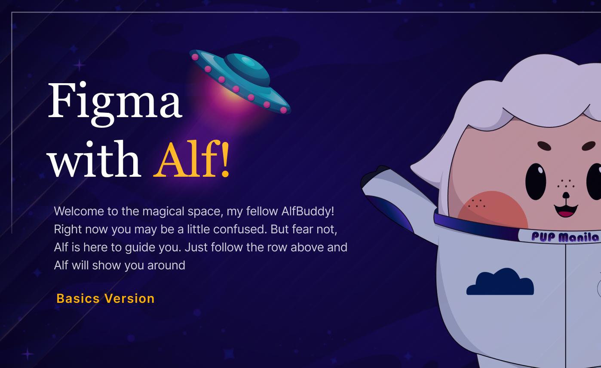

**<h1 align="center"> DAY 2: Figma Basics </h1>**
**_Have you ever wished for a magical canvas where creativity knows no bounds, and collaboration seamlessly intertwines with design?_**

Well, enter Figma, the virtual wonderland for designers and creative teams alike. Imagine a platform that not only brings your design visions to life but also transforms collaboration into an art form!

At its core, **Figma** is a cloud-based design tool that transcends the boundaries of traditional design software. No need for hefty installations or complicated setups—Figma lives in the cloud, accessible anytime, anywhere. It's not just a tool; it's a gateway to a new era of collaborative design.

### **Pre-requisite**

---

1. Install figma desktop app (optional). You can also use its browser version.

    - Link: [Download Figma Desktop App](https://www.figma.com/downloads/)
    - [Installation Guide](https://help.figma.com/hc/en-us/articles/5601429983767-Guide-to-the-Figma-desktop-app)
    - **If you DON'T want to install:** [Figma Browser](https://www.figma.com/)

2. Create an account on figma.
    - **Guide:** [Create a Figma Account Tutorial](https://help.figma.com/hc/en-us/articles/360039811114-Create-a-Figma-account)

## **About the Challenge:**

#### **🎨 Tutorial: Figma Basics**

The challenge is to initiate a learning journey by venturing into the realm of Figma as you delve into the field of UI/UX Designing, with the goal of taking the first step towards mastering Figma as a powerful ally for crafting seamless user experiences in the dynamic world of UI/UX design.

**<h3>Situation:</h3>**
You are an aspiring UI/UX designer about to embark on the exciting journey into the realm of UI/UX design. After some initial analysis, your next move is to master Figma – the go-to app for many UI/UX designers.

### ✅ To-Do List

    ☐ Finish the 3 parts tutorial in figma
    ☐ Learn its tools, interface, and how to build layouts
    ☐ Finish the activity about creating a simple layout

### 📋 Instructions

1. Open the provided link: [Figma Basics Tutorial](https://www.figma.com/community/file/1306702678560541195/awscc-figma-workshop-basics) _(If prompted, log in to your Figma account.)_

    - Note: Right click and open it in a new tab
        

        
        

         

2. Click on the **"Open in Figma"** button. This will duplicate the file on your figma account.  

 

3. Enjoy exploring the figma workspace ~

**<h3>Show off your work!</h3>**

Submit your work here: <a href="../../submissions/exercises/day02.md" target="_blank">../../submissions/exercises/day02.md</a>

Paste a picture of your finished activity and provide a brief explanation of your experience or reflection _(reflection is optional)_.

-   [How to add an image on README](https://www.seancdavis.com/posts/three-ways-to-add-image-to-github-readme/)

## Resources

> <a href="https://www.youtube.com/watch?v=Cx2dkpBxst8&list=PLXDU_eVOJTx7QHLShNqIXL1Cgbxj7HlN4" target="_blank">Figma | Figma Beginners Tour</a>

> <a href="https://help.figma.com/hc/en-us/articles/360038511533-Duplicate-or-copy-files" target="_blank">Duplicate/Copy Files in Figma</a>

> <a href="https://designlab.com/figma-101-course/introduction-to-figma/" target="_blank">Introduction to Figma</a>
