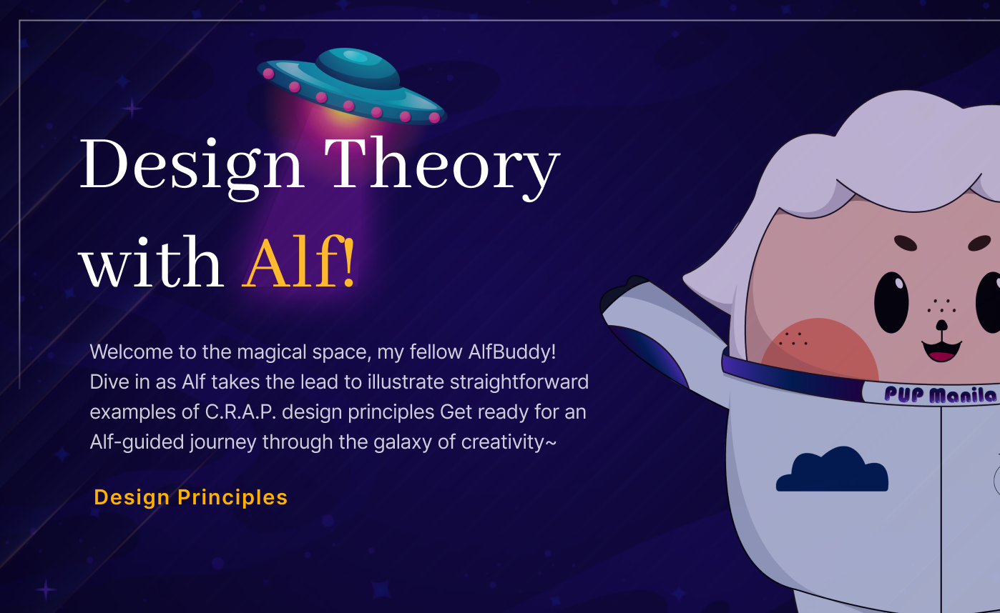

**<h1 align="center"> DAY 3: Design Principles </h1>**
**What if I told you there's a set of principles that could turn any design from mundane to magnificent?**

Enter the world of C.R.A.P., where Contrast, Repetition, Alignment, and Proximity work their magic. These principles, encapsulated in a powerful acronym, are the secret sauce behind captivating and effective designs. Get ready to dive into the realm where creativity meets structure, as we explore the fundamentals that elevate designs to a whole new level.

## **🎨 Introduction to C.R.A.P. Design Principles**

C.R.A.P. is an acronym of four graphic design principles coined by Robin Patricia Williams, representing: Contrast, Repetition, Alignment, and Proximity. They are design principles, which are like a handy toolkit for making websites look and work better. Designers should keep these principles in mind every time they create something.

Learn more about **C.R.A.P** design principles by visiting <a href="https://www.figma.com/community/file/1308155740291715507/awscc-ui-ux-c-r-a-p-design-principles" target="_blank">**AWSCC UI/UX: C.R.A.P. Design Principles**</a>.

-   Note: Right click and open it in a new tab

&nbsp;&nbsp;&nbsp;&nbsp;&nbsp;&nbsp;&nbsp;&nbsp;

 

## **About the Challenge:**

Applying **C.R.A.P. principles** help create designs that are clear, engaging, and visually harmonious. The challenge entails honing your skills in analyzing C.R.A.P. design principles to distinguish visually appealing and effective designs.

The goal is to develop a keen understanding of these principles, enabling you to create designs that not only captivate visually but also effectively convey your intended message.

**<h3>Situation:</h3>**
Exploring the realm of UI/UX design, you have come to appreciate the significance of design analysis and the underlying principles essential for examination. Now, you are actively immersing yourself in understanding key design principles that will greatly enhance your skills. As you acquaint yourself with the C.R.A.P. design principles, you are on a journey to identify and implement effective designs that seamlessly integrate these foundational principles.

### ✅ To-Do List

    ☐ Finish the 3 parts tutorial in figma
    ☐ Learn its tools, interface, and how to build layouts
    ☐ Finish the activity about creating a simple layout

### 📋 Instructions

Evaluate and choose the preferred UI design by considering its adherence to the C.R.A.P. design principles presented. _There is no need for explanation. -^^-_

&nbsp;&nbsp;&nbsp;&nbsp;**Day 3: C.R.A.P. Design Principles Activity** 

-   Visit <a href="https://www.figma.com/community/file/1308267154487897637/week-1-day-3-activity" target="_blank">Week 1 [Day 3] : Activity</a> and click on [**Open in Figma**].

&nbsp;&nbsp;&nbsp;&nbsp;&nbsp;&nbsp;&nbsp;&nbsp;

-   You'll discover shooting target icons, which you'll drag, drop, and resize onto your preferred UI while adhering to the principles of C.R.A.P. (Contrast, Repetition, Alignment, and Proximity).
      

**<h3>Show off your work!</h3>**

Submit your work here: <a href="../../submissions/exercises/day03.md" target="_blank">../../submissions/exercises/day03.md</a> _(Just paste your figma link)_

Share your choices or preferred UI designs in accordance with the design principles under consideration. Feel free to include a screenshot of the Can’t Unsee Game's score. Add any short comments or feedback about the game; it's optional but greatly appreciated!

## Resources

> <a href="https://cantunsee.space/" target="_blank">Game: Can't Unsee</a>

> <a href="https://vwo.com/blog/crap-design-principles/" target="_blank">[1] C.R.A.P. Design Principles</a>

> <a href="https://attentioninsight.com/crap-design-principles/" target="_blank">[2] C.R.A.P. Design Principles</a>

> <a href="https://bootcamp.uxdesign.cc/why-your-designs-should-be-crap-f8c0a37f1fa5" target="_blank">Why your designs should be CRAP</a>
