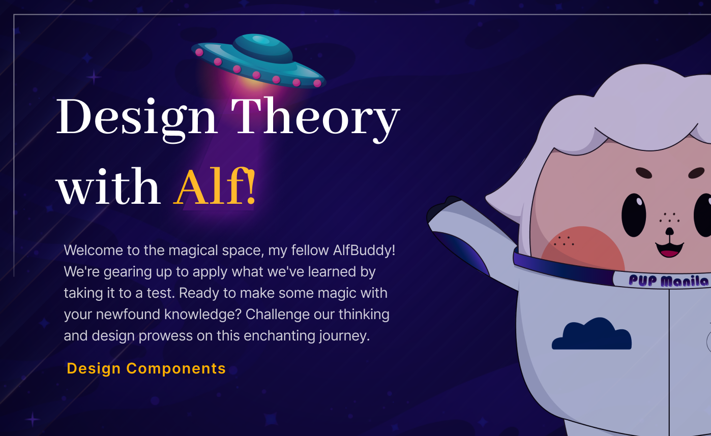

**<h1 align="center"> DAY 4: Design Components </h1>**
**_Ever wondered how a simple combination of colors, typography, visual hierarchy, and whitespace can turn a bland design into a visual masterpiece?_**

Think of colors as the paint on an artist's palette, typography as the carefully chosen words in a story, visual hierarchy as the roadmap guiding your eyes, and whitespace as the breathing room that brings harmony. Each component plays a crucial role in crafting designs that not only catch the eye but also convey messages effectively. So, let's delve into the magic of colors, the power of typography, the art of visual hierarchy, and the significance of whitespace—the pillars that elevate design to a whole new level!

## **Introduction to Design Components**

**<h3>About the challenge:**</h3>
Design components serve to shape a brand's identity and enhance user engagement. They provide a visual language that communicates the brand's personality, guides users through content, and ensures a seamless and intuitive experience.

The challenge focuses on the ability to analyze and make appropriate decisions within each design component. The main goal is to integrate the lessons you've learned in this lesson to make a design more accessible.

### ✅ To-Do List

    ☐ Learn about visual hierarchy, colors, and typography
    ☐ Do the hands-on activities to practice the concepts you've learned
    ☐ Design a layout that is focused on accessibility

### 📋 Instructions

1. Open the provided link: [Week 1: Design Components [tutorial and activity]](https://www.figma.com/community/file/1308706627963958604/week-1-day-4-design-components) _(If prompted, log in to your Figma account.)_

    - Note: Right click and open it in a new tab
      

      &nbsp;&nbsp;&nbsp;&nbsp;&nbsp;&nbsp;&nbsp;&nbsp;
      

       

2. Click on the **"Open in Figma"** button. This will duplicate the file on your figma account.  

 

3. Enjoy exploring the figma workspace ~

**<h3>Show off your work!</h3>**

Submit your work here: <a href="../../submissions/exercises/day04.md" target="_blank">../../submissions/exercises/day04.md</a>

Share your responses to the questions. Providing an explanation is optional but greatly appreciated. What's important, though, is to demonstrate your prowess in analyzing and selecting the most fitting choices~

## Resources

> <a href="https://coolors.co/contrast-checker" target="_blank">Color Contrast Checker - Coolors</a>

> <a href="https://www.ipoint.com.mt/blog/website-personality-matters-see-which-one-is-perfect-for-you-and-why/" target="_blank">Website Personality Matters!</a>

> <a href="https://www.flux-academy.com/blog/how-to-strategically-use-color-in-website-design" target="_blank">How to strategically use color in website design?</a>

> <a href="https://www.interaction-design.org/literature/article/the-ux-designer-s-guide-to-typography" target="_blank">The UX Designer’s Guide to Typography</a>

> <a href="https://www.youtube.com/watch?v=ShSNbXkxQS8" target="_blank">Creative Crew with Brad Hussey | 30 Web Design Tips in 11 Minutes</a>
