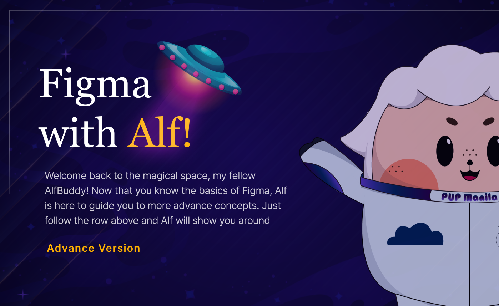

**<h1 align="center"> DAY 5: Figma Tutorial (Advance) </h1>**
**_Curious about unlocking more possibilities with Figma?_**

As you embark on your journey into the advanced realms of this versatile design tool, you're about to discover MORE—no, not just a word, but an acronym encapsulating a treasure trove of capabilities: Mastering, Optimizing, Refining, and Elevating your design process.

Figma, celebrated for its user-friendly interface, is not merely a canvas for creating digital masterpieces but a dynamic platform offering advanced features that can transform your design workflow. Let's delve into the nuances of each element of MORE and unravel the potential that awaits as you navigate the intricate landscape of Figma, taking your design skills to new heights.

## About the challenge:

#### **🎨 Tutorial: Figma Advance Concepts**

By now, you have become familiar with the basics of Figma, and it is time to elevate your skills to the next level. Today's focus is on advancing your mastery of Figma, unlocking its more sophisticated features and functionalities.

As you progress in your UI/UX design journey, mastering advanced features in Figma will empower you to create intricate designs, streamline collaboration, and enhance your overall design workflow. This phase of the challenge aims to deepen your understanding and proficiency in utilizing Figma's advanced functionalities, empowering you to tackle complex design projects with confidence.

### ✅ To-Do List

    ☐ Build cool graphics using the pen tool
    ☐ Lear Auto Layout to make designing easier
    ☐ Know more about constraints and grids

### 📋 Instructions

1. Open the provided link: [Figma Advance Tutorial](https://www.figma.com/community/file/1306705100729931279/awscc-figma-workshop-advance) _(If prompted, log in to your Figma account.)_

    - Note: Right click and open it in a new tab
        

        
        

         

2. Click on the **"Open in Figma"** button. This will duplicate the file on your figma account.  

 

3. Enjoy exploring the figma workspace ~

**<h3>Show off your work!</h3>**

Submit your work here: <a href="../../submissions/exercises/day05.md" target="_blank">../../submissions/exercises/day05.md</a>

Feature the Advance Figma Tutorial you have engaged with and provide a brief explanation of your experience or reflection. Feel free to try out the games available during your leisure time!

## Resources

> <a href="https://bezier.method.ac/" target="_blank">Game: The Bézier Game</a>

> <a href="https://type.method.ac/" target="_blank">Game: Kern Type</a>

> <a href="https://boolean.method.ac/" target="_blank">Game: The Boolean Game</a>

> <a href="https://www.youtube.com/watch?v=eARLkF2P6Y4" target="_blank">Mizko | 14 Advanced Tips to Design FASTER in Figma</a>
