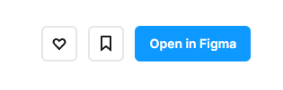

**<h1 align="center"> DAY 6: Prototyping </h1>**
**_How do designers go about transforming static designs into interactive marvels?_**

Figma, more than just a design tool, serves as a dynamic platform where you can simulate user interactions, test functionalities, and bring your designs to life. Imagine visualizing the flow of your creations effortlessly—all within a single space.

In this exploration, we'll unravel the essentials of prototyping in Figma, breaking it down for beginners.

## Prototyping

**Prototyping** means making your designs clickable and interactive. You connect buttons and screens, add transitions and animations _(like Smart Animate for smooth moves)_, and then you can preview how it all works. Its like a sneak peek at how users will experience your app or website.

In Figma, it lets you easily share this sneak peek so others can check it out and give feedback. Prototyping is like trying out your ideas before building the real thing, helping you fix any problems early and make your design better. It's like a test drive for your digital creations!

-   Learn More about prototyping:
    > -   Video Link: [**_How to Prototype_**](https://www.youtube.com/watch?v=-sAAa-CCOcg)
    > -   Article Link: [**_How to Prototype_**](https://help.figma.com/hc/en-us/articles/360040314193-Guide-to-prototyping-in-Figma)

## About the challenge:

#### **🎨 Tutorial: Prototyping**

The challenge involves getting acquainted with Figma's prototyping features, allowing you to craft interactive designs with clickable elements and animations. Your goals encompass simulating user interactions for feedback, utilizing Figma's collaboration tools, and iteratively refining the prototype to ensure a user-friendly and efficient experience.

**<h3>Situation:</h3>**
You are excelling on your journey to master Figma skills! As you advance your familiarity with Figma, you are now delving into prototyping to enhance your understanding of creating interactive designs. Taking the step into designing for interactivity, you are leveraging your training to proficiently apply these newfound skills.

### ✅ To-Do List

    ☐ Build cool graphics using the pen tool
    ☐ Lear Auto Layout to make designing easier
    ☐ Know more about constraints and grids

### 📋 Instructions

1. Open the provided link: [Week 1: Prototyping](https://www.figma.com/community/file/1307236443396435220/awscc-figma-workshop-prototype) _(If prompted, log in to your Figma account.)_

    - Note: Right click and open it in a new tab
      

      
      

       

2. Click on the **"Open in Figma"** button. This will duplicate the file on your figma account.  

 

3. Enjoy exploring the figma workspace ~

**<h3>Show off your work!</h3>**

Submit your work here: <a href="../../submissions/exercises/day06.md" target="_blank">../../submissions/exercises/day06.md</a>

Share the link to your creation, highlighting how you have applied your skills and knowledge in prototyping to produce an impressive output.

## Resources

> <a href="https://www.youtube.com/watch?v=-sAAa-CCOcg" target="_blank">Figma | Figma Tutorial: Prototyping</a>

> <a href="https://www.youtube.com/watch?v=zFBa7URT654" target="_blank">LinkedIn Learning | UX Prototyping Tutorial - What is a prototype?</a>

> <a href="https://help.figma.com/hc/en-us/articles/360040314193-Guide-to-prototyping-in-Figma" target="_blank">Guide to Prototyping in Figma</a>

> <a href="https://www.simplilearn.com/prototyping-in-design-thinking-article#:~:text=Thus%2C%20prototyping%20allows%20designers%20to,too%20many%20resources%20get%20used" target="_blank">Prototyping In Design Thinking: Definition, Types & Benefits</a>
