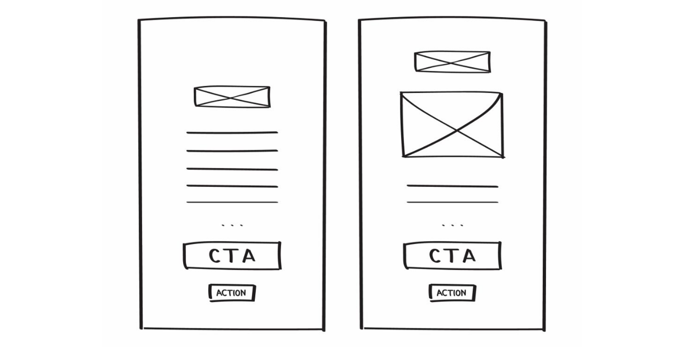
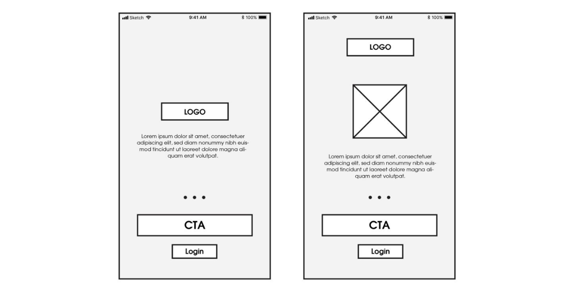
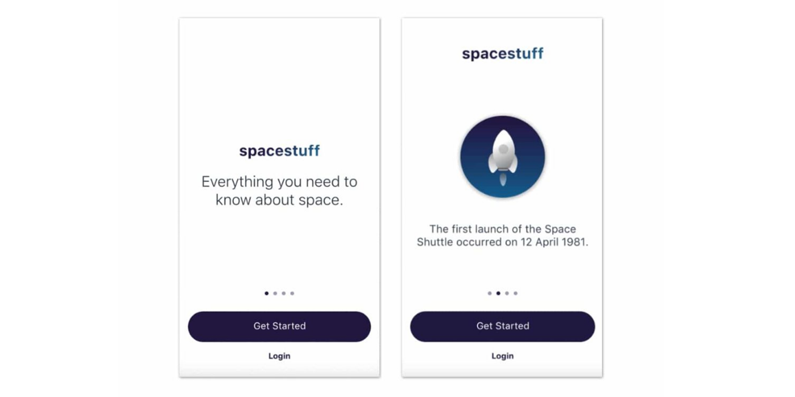
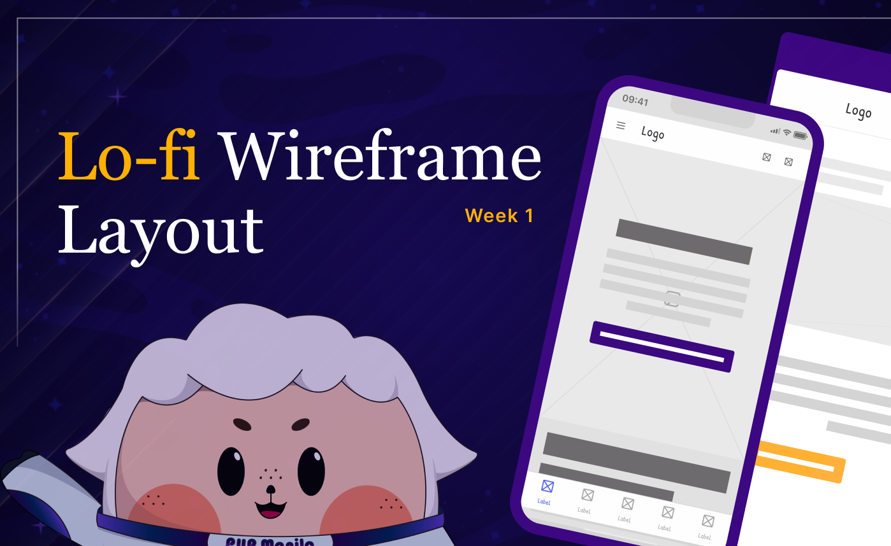

**<h1 align="center"> DAY 7: Wireframe Fidelity</h1>**
**_What sparks your curiosity about transforming design ideas into tangible digital prototypes?_**

Let's talk about **wireframe fidelity** — your secret weapon for making ideas come alive on screens. Think of wireframes as the blueprint of your digital masterpiece, laying out the essential parts without getting caught up in colors and fancy details. Figma makes it super easy for beginners and pros to create designs that just work.
With Figma's versatile wireframing tools, you can efficiently iterate and collaborate, ensuring your design concepts seamlessly evolve from basic outlines to polished user experiences.

## **Introduction to Wireframe Fidelity**

Wireframe fidelity refers to the level of detail and complexity in the design representation, and it is categorized into three levels: low-fidelity (lo-fi), mid-fidelity (mid-fi), and high-fidelity (hi-fi).

#### **Low-Fidelity Wireframes (Lo-Fi)** 

Low-fidelity wireframes are like rough sketches of your digital product. They're simple, quick, and focus on the basic structure and layout without much detail.

Think of it as a quick doodle that captures the main ideas without getting into specifics. These wireframes are perfect for early brainstorming sessions, helping you explore different concepts without investing too much time or effort. 

 

**Mid-Fidelity Wireframes (Mid-Fi)** 
Moving up the fidelity ladder, mid-fidelity wireframes add more detail to the structure. They're like a more polished draft of your digital design, including basic elements like buttons, text, and images.

While not as refined as the final product, mid-fidelity wireframes give a clearer picture of the user interface and interaction flow. They strike a balance between speed and detail, allowing you to iterate on your design before diving into the nitty-gritty details. 

 

**High Fidelity Wireframes (Hi-Fi)** 
High-fidelity wireframes are the most detailed and refined version of your design before the actual development phase. They include precise details on colors, fonts, and interactive elements, closely resembling the final product.

These provides a realistic preview of how the user interface will look and function. High-fidelity wireframes are useful for getting stakeholder approval, conducting user testing, and guiding developers during implementation. They are like the polished blueprint that ensures everyone is on the same page before turning your design into reality. 

  

## About the challenge:

The first phase when building wireframes is **lo-fi**. That's why understanding the significance of lo-fi wireframes is crucial during the initial design stages. It enables you, as a designer, to swiftly explore ideas, iterate efficiently, and obtain feedback without being bogged down by minor nuances. The challenge involves developing a replica that effectively captures the essence of a low-fidelity wireframe.

**<h3>Situation:</h3>**
You are excelling on your journey to master Figma skills! As you advance your familiarity with Figma, you are now delving into prototyping to enhance your understanding of creating interactive designs. Taking the step into designing for interactivity, you are leveraging your training to proficiently apply these newfound skills.

### ✅ To-Do List

    ☐ Create a low-fidelity wireframe for the SECTION of the website/app you picked.

### 📋 Instructions

Choose your favorite social media application/website. Decide what section you want to replicate in which you will develop a lo-fi wireframe clone.

&nbsp;&nbsp;&nbsp;&nbsp;**Figma: Low Fidelity Layout** 

1. Visit <a href="https://www.figma.com/community/file/1307223761496070401/week-1-low-fidelity-layout" target="_blank">Week 1 [Day 7]: Low-Fidelity Layout</a> and click on [**Open in Figma**].
    - Note: Right click and open it in a new tab
        

        
        

2. In the Figma file, take a look at the sample lo-fi wireframe clone.
3. Watch the provided video: _(If you need guidance)_
    > - [**Wireframe Tutorial for Beginners**](https://www.youtube.com/watch?v=D4NyQ5iOMF0)

**<h3>Show off your work!</h3>**
Submit your work here: <a href="../../submissions/exercises/day07.md" target="_blank">../../submissions/exercises/day07.md</a>

Share the Figma link for your lo-fi wireframe clone. Attach a few sneak peeks of your wireframes to give us a glimpse of your creation, and remember to mention the application you have chosen to clone.

## Resources

> <a href="https://www.freecodecamp.org/news/what-is-wireframing/" target="_blank">What is Wireframing?</a>

> <a href="https://www.youtube.com/watch?v=Dh14MmPBvZA" target="_blank">Uxable - Learning UX Together | Wireframes vs Prototypes</a>

> <a href="https://productiveshop.com/understanding-wireframe-fidelity-in-website-design/" target="_blank">Understanding Wireframe Fidelity in Website Design</a>

> <a href="https://www.youtube.com/watch?v=D4NyQ5iOMF0" target="_blank">Aliena Cai | Figma UX tutorial for beginners - Wireframe</a>
