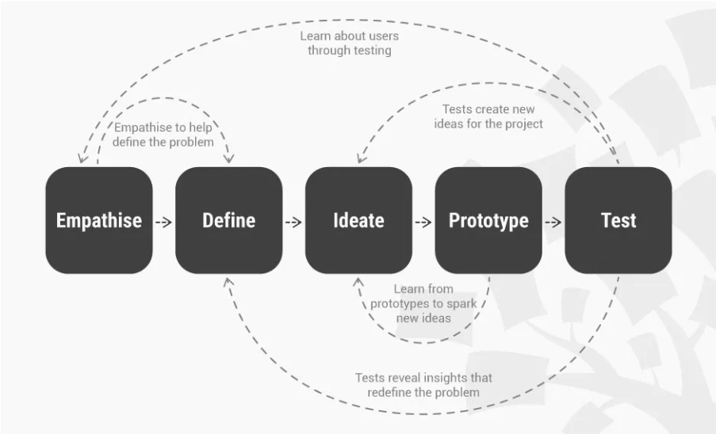
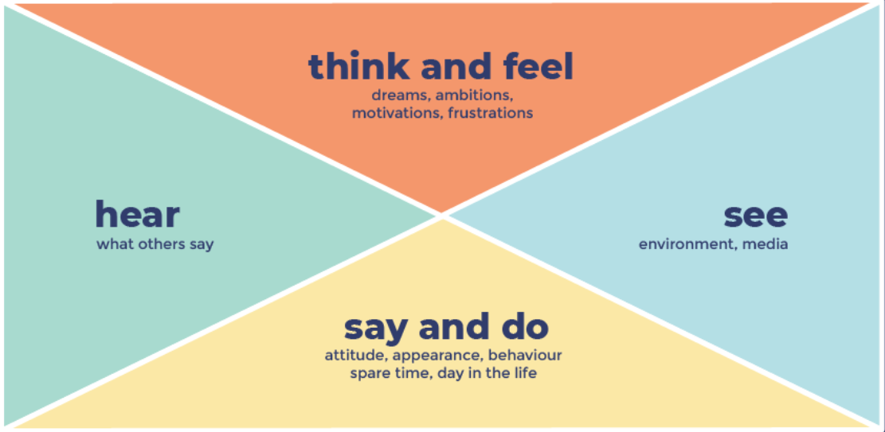
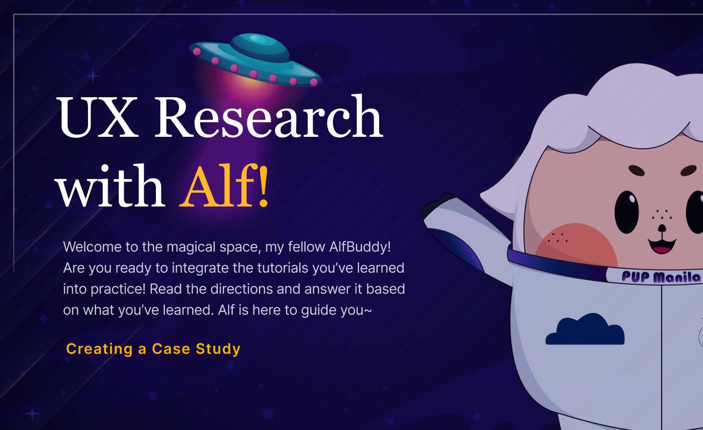
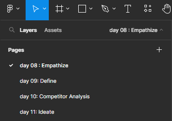

**<h1 align="center"> DAY 8: Design Sprint (Empathy)</h1>**
**How do UX designers improve the user experience when all websites follow the same layout?**

>**Answer:**   By understanding the user through UX Research

### 📊 UX Research 

The process of understanding the user to get insights on how to improve their user experience. As a UX Researcher, your main goal is to understand the users, their behaviors, motivations, and pain points, and use this information to inform the design process.

### 🏃🏻 Design Sprint 

-   Process in UX Research which is done to deliver innovative, user-friendly solutions within tight timelines. It is a time-bound process with five phases typically spread out over 5 days to 1 week.  
-   Done after the interviews and user research you've conducted _(You won’t be doing it in this workshop)_

    #### 5 Phases:
 
    
&nbsp;&nbsp;&nbsp;&nbsp;&nbsp;&nbsp;&nbsp;&nbsp;
 

  - **Empathize** - understand who your users are and what they need.
  - **Define** - define the user problem you want to solve based on the empathy phase.
  - **Ideate** - come up with possible solutions from the problem you found in the define phase.
  - **Prototype** - turn your ideas from stage three into prototypes.
  - **Test** - putting your prototypes in front of real users and seeing how they interact with it.
   
      Witness a real-world example of the design sprint process through **_Spotify’s design sprint process_**

    Click Here: [**_Spotify Design Sprint Process_**](https://www.figma.com/community/file/961940615273396965)

 

## **First Phase: Empathize**

  
**Empathize:**
The first step in any design sprint is to understand the problem from the user's perspective.

### 🧑 User Persona 

  - Are fictional characters created to represent the various user types within a targeted demographic. It is used to build empathy with your target users and identifying exactly what they need from the product you’re designing.

>  **_A persona clarifies who is in your target audience by answering the following questions:_**

-   Who is my ideal customer?
-   What are the current behavior patterns of my users?
-   What are the needs and goals of my users?
-   What issues and pain points do they currently face within the given context?  

    Witness a real-world example of the user persona through Small PDF’s User Persona

    Click Here: [Small PDF's User Persona](https://www.hotjar.com/blog/user-personas/)  

### 🗣️ How to communicate empathy in UX 🗣️

**Empathy** is something we should show not only to our users but also to our team members. It helps in visually representing the user’s thoughts, feelings, actions, and motivations.

#### 📍 Empathy Maps

**Empathy Mapping** focuses on identifying key themes and issues affecting users based on their quotes, actions, behaviors, and feelings captured throughout user research and expert interviews. If you’re a UX researcher, common practice is to have one empathy map per customer persona.

&nbsp;&nbsp;&nbsp;&nbsp;&nbsp;&nbsp;&nbsp;&nbsp;

-   **Says:** When doing an interview, this is where the overall quotes from the different users is gathered

-   **Thinks:** It is more focused on what a user is thinking and doesn’t choose to say out loud. Example: What are their goals, aspirations, or concerns that might not be explicitly expressed?

-   **Does:** What specific actions do they take in relation to the product or service? This could include physical actions(ex: clicking buttons on a website)

-   **Feels:** Explores the emotion of the user, Example: _“What is the user feeling during this product experience?”_ or _“What worries or excites the user?”_ 
##
## **About the Challenge:**

As the lead designer for AlfBuddy, an emerging e-commerce pet shop, you've encountered a significant challenge. AlfBuddy's users have expressed frustration with the website's navigation, prompting a deeper exploration into user understanding.

Your goal today is to harness the power of empathy. By creating detailed User Personas and Empathy Maps, you aim to build a strong connection with the users. This deeper understanding will inform the design process, ensuring that the redesigned website addresses the specific needs and preferences of pet-loving customers.

### ✅ To-Do List

    ☐ Identify Product Users
    ☐ Create a User Persona
    ☐ Create an Empathy Map

### 📋 Instructions

1. Open the provided link: [Week 2 [day 8 - 11] : Activity Workspace](https://www.figma.com/community/file/1307726958398843883/week-2-day-8-11-activities) _(If prompted, log in to your Figma account.)  

 

2. Click on the **"Open in Figma"** button. This will duplicate the file on your figma account.  

  

3.  Check the day you're in in the pages section. Today is **Day 08**, so make sure you're on day 08 page section in figma.  

## Show off your work!

Submit your work here _(just paste the link of the figma file you've made)_: <a href="../../submissions/exercises/day08-11.md" target="_blank">../../submissions/exercises/day08-11.md</a>

## Resources
> [**Design Sprint**](https://uxplanet.org/whats-a-design-sprint-and-why-is-it-important-f7b826651e09)

> [**Empathize Process**](https://www.interaction-design.org/literature/topics/empathize#:~:text=Empathize%20is%20the%20first%20stage,'%20experiences%2C%20motivations%20and%20problems.)

> [**How to create a user persona**](https://xtensio.com/how-to-create-a-persona/)

> [**How to build an empathy map**](https://www.nngroup.com/articles/empathy-mapping/)

