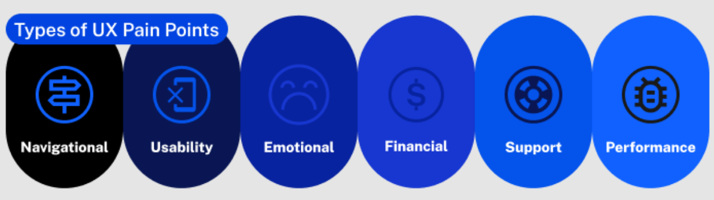
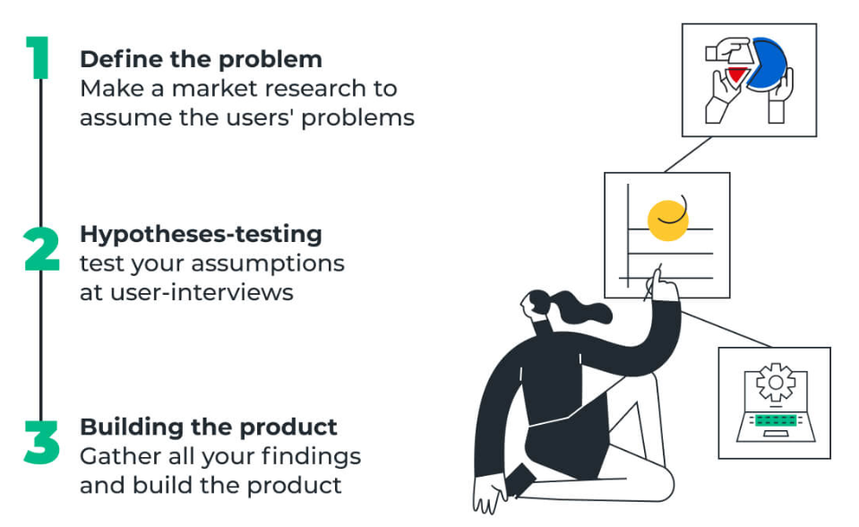
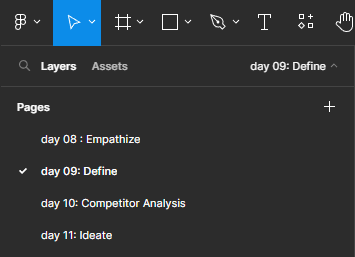

**<h1 align="center"> DAY 9: Design Sprint (Define)</h1>**
In here, you’ll define the user problem you want to solve. The **DEFINE PHASE** ensures you fully understand the goal of your design project. It helps you to articulate your design problem, and provides a clear-cut objective to work towards.

## 📄 Formulating a Strong Problem Statement

### **Problem Statement**

-   is a clear, concise description of the user problem a UX designer needs to solve.

_Example:_

>  &nbsp;&nbsp; > _[User A] experiences [this problem] when they [try to complete this action / use a particular product or service] in [this context]. This is a problem because [it has this impact on the user experience and on the business]._ 
> &nbsp;&nbsp;

 

### ✍️ How to write a good problem statement

#### Using the 6W’s technique:

-   Who is impacted by the problem?
-   What is the problem they are facing?
-   Where does this problem come up?
-   When does the problem occur? In what situation?
-   Why does the problem arise?
-   Why does the problem matter? What impact does it have on the end user and/or the business?  

## 🔎 Identifying Pain Points in UX

Pain points are areas in the user interface (UI) that cause frustration or difficulty for users. It can lead to user dissatisfaction, which results in lost customers and sales. Understanding them means that you can identify areas of improvement and develop strategies to address them.

### **Usability pain points**

-   related to the usability of a product or service, such as difficulty navigating the website, slow loading times, or confusing navigation menus. 

&nbsp;&nbsp;&nbsp;&nbsp;&nbsp;&nbsp;&nbsp;&nbsp;
  

## 📈 Defining Success Metrics:

To measure the success of your Design Sprint, it's essential to establish clear objectives, goals, and user needs.

### User Needs

-   are the specific requirements and expectations of users that a product or service should fulfill to provide value and enhance their experience.

**How to define user needs:**

&nbsp;&nbsp;&nbsp;&nbsp;&nbsp;&nbsp;&nbsp;&nbsp;
 

##

## **About the Challenge:**

Despite having quality products, the user navigation on the website is causing a decline in sales. To tackle this issue, your goal is to establish a strong foundation for the UX case study

Today, your objective is to dive into the AlfBuddy website itself. By identifying pain points through a targeted analysis, you aim to pinpoint specific areas that contribute to user frustration. While also crafting a precise problem statement, defining objectives, and identifying user needs, you aim to lay the groundwork for a targeted and effective redesign.

### ✅ To-Do List

    ☐ Create a Problem Statement
    ☐ Define the Objectives & Goals
    ☐ Identify the Pain Points of AlfBuddy's Website

### 📋 Instructions

1. Go to your figma homepage and check recents, find the file for **Week 2 [day 8 - 11] : Activities**    

 

2. Check they day you're in in the pages section. Today is **Day 09**, so make sure you're on day 09 page section in figma  

## Show off your work!

Submit your work here _(just paste the link of the figma file you've made)_:
<a href="../../submissions/exercises/day08-11.md" target="_blank">../../submissions/exercises/day08-11.md</a>

## Resources
> [**How to write a problem statement**](https://careerfoundry.com/en/blog/ux-design/problem-statement-ux/)

> [**How to identify paint points**](https://www.mural.co/blog/identify-user-pain-points)

> [**Defining Goals and Objectives in UI/UX**](https://www.toptal.com/designers/ux/ux-projects-think-smart)

> [**Identify User Needs**](https://www.uxpin.com/studio/blog/user-needs/)

