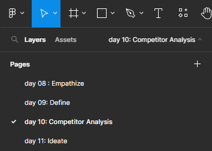

**<h1 align="center"> DAY 10: Competitor Analysis</h1>**
In the fast-evolving landscape of User Experience (UX) design, staying ahead requires more than just creativity and innovation—it demands a keen understanding of your competitors. Competitor analysis in UX is a crucial step towards creating designs that not only meet user expectations but also outperform the competition.

## 🏆 Competitor Analysis

is the process of examining similar brands in your industry to gain insight into their offerings, branding, sales, and marketing approaches.

### How to do a competitor analysis

1. **Identify your objectives**

    > _Example:  
    > if you’re creating a new app where users can stream movies and TV shows, one of your objectives might be to understand how competitors draw users’ attention to new entertainment choices_.

2. **Identify your competitors**
    > These could be companies offering similar products or services, targeting the same user demographic.
3. **Analyzing Interaction and visual design**

    > - Delve into the **_interactive elements of competitor interfaces_**. Look at how they handle user interactions, such as form submissions, button clicks, or navigation.
    > - Consider how they use color, imagery, and typography to convey their **_brand identity_**.

4. **Incorporating Findings into Your Design Process**

    > Identify patterns, strengths, and weaknesses in your competitors' UX design. Use these insights to inform your own design decisions.

##

## **About the Challenge:**

In the world of e-commerce, standing out is crucial. AlfBuddy is facing stiff competition, and user feedback suggests that the website lacks certain features found on competitors' platforms.

Today, your task is to conduct a Competitor Analysis to gain insights into the strengths and weaknesses of rival pet shops. By identifying unique features, you aim to position AlfBuddy as a standout destination for pet enthusiasts.

### ✅ To-Do List

    ☐ Evaluate other companies similar to AlfBuddy
    ☐ Create a Competitor's Analysis

### 📋 Instructions

1. Go to your figma homepage and check recents, find the file for **Week 2 [day 8 - 11] : Activities**    

 

2. Check the day you're in in the pages section. Today is **Day 10**, so make sure you're on day 10 page section in figma.   

   
## Show off your work!</h3>

Submit your work here _(just paste the link of the figma file you've made)_: <a href="../../submissions/exercises/day08-11.md" target="_blank">../../submissions/exercises/day08-11.md</a>

## Resources
>[**Guide to Competitor's Analysis**](https://usabilitygeek.com/how-to-do-ux-competitor-analysis/)
