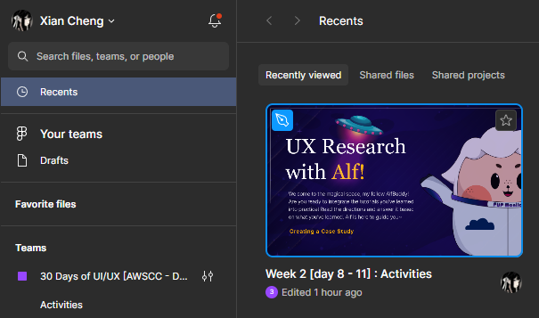

**<h1 align="center"> DAY 11: Design Sprint (Ideate Phase)</h1>**

The main aim of the **Ideation stage** is to use creativity and innovation in order to develop solutions.

You need to understand the users before moving on to this process. If you don’t understand your users, the ideas you generate will be worthless: they may not be on target, and, even worse, you won’t have the correct evaluation criteria for determining which idea is the best and should be implemented.

## **About the Challenge:**

The challenges facing AlfBuddy have been identified, and user needs are at the forefront. Today, your mission is to turn insights into actionable solutions.

As the lead designer, you're tasked with generating features and functionalities that directly address the pain points identified throughout the activity in the define phase. Moreover, the focus is on highlighting the unique features that AlfBuddy can leverage to distinguish itself in the competitive landscape.

### ✅ To-Do List

    ☐ Brainstorm the features & functionals that will resolve the user needs
    ☐ Give the unique features that can make AlfBuddy unique than the other competitors

### 📋 Instructions

1. Go to your figma homepage and check recents, find the file for **Week 2 [day 8 - 11] : Activities**   

 

2. Check the day you're in in the pages section. Today is **Day 11**, so make sure you're on day 11 page section in figma.

## Show off your work!</h3>

Submit your work here _(just paste the link of the figma file you've made)_: <a href="../../submissions/exercises/day08-11.md" target="_blank">../../submissions/exercises/day08-11.md</a>

## Resources
> [**Design Sprint: Ideate**](https://medium.com/@anthonyrousounelos/the-ideation-sprint-cross-functional-design-with-minimum-resources-38ce35ff4328)

