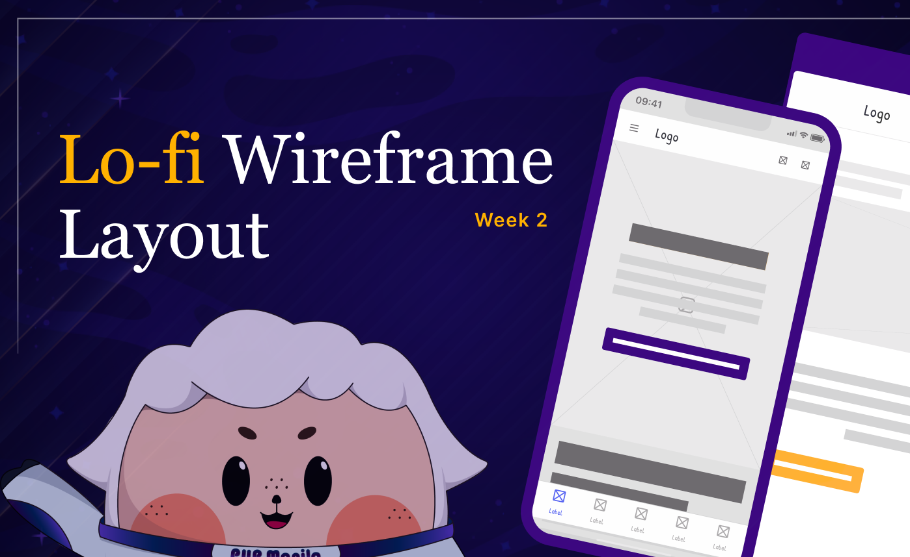
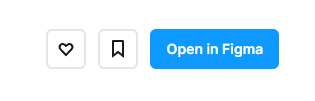

**<h1 align="center"> DAY 12 - 14: Design Sprint (Prototype)</h1>**

**Prototyping** is a crucial phase in the Design Sprint methodology. It involves creating a tangible representation of your solution, allowing you to test and iterate before investing significant time and resources into development. The goal is not perfection but rather to quickly convey the flow and functionality of your proposed solution.

### Learn more about low-fidelity wireframe

-   [Low-fidelity VS. High-fidelity](https://webflow.com/blog/low-vs-high-fidelity)
-   [Learn how to build wireframes](https://www.youtube.com/watch?v=qpH7-KFWZRI&ab_channel=CareerFoundry)

## **About the Challenge:**

Your task today is to create a low-fidelity wireframe for the redesigned AlfBuddy website. As the lead designer, you'll leverage your knowledge of the design principles you've learned in WEEK 1 and UX Research in Week 2.

Since you've already analyze the pain points and know what the users' wants. This is now the time to make the solutions you've brainstormed in the IDEATE Phase come into life! This wireframe will serve as the blueprint for the high-fidelity wireframe you'll build during Week 3.

### ✅ To-Do List

    ☐ Integrate the research you've done in day 8 - 9 when making the lo-fi wireframe
    ☐ Improve the layout of Alfbuddy's website and show it by creating the lo-fi wireframe

### 📋 Instructions

1. Open the provided link: [Week 2 [day 12 - 14] : Alf Buddy Lo-fi Wireframe](https://www.figma.com/community/file/1307727312799989741/week-2-alfbuddy-lo-fi-wireframe
)_(If prompted, log in to your Figma account.)_

 

2. Click on the **"Open in Figma"** button. This will duplicate the file on your figma account.  

 

3. Navigate the workspace and start building your wireframe ~

## Show off your work!</h3>

Submit your work here _(just paste the link of the figma file you've made)_ : <a href="../../submissions/final-projects/day12-14.md" target="_blank">../../submissions/final-projects/day12-14.md</a>

## Resources
> [**Design Sprint: How to build a Prototype**](https://www.workshopper.com/post/design-thinking-phase-4-everything-you-need-to-know-about-prototyping)

> [**Brainstorm and build a prototype**](https://www.linkedin.com/advice/0/what-best-practices-brainstorming-prototyping)

> [**Guide to low-fidelity prototyping**](https://devsquad.com/blog/low-fidelity-prototyping)

