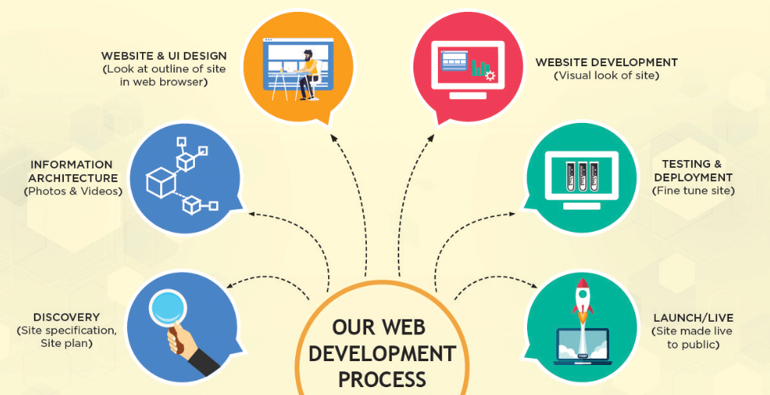
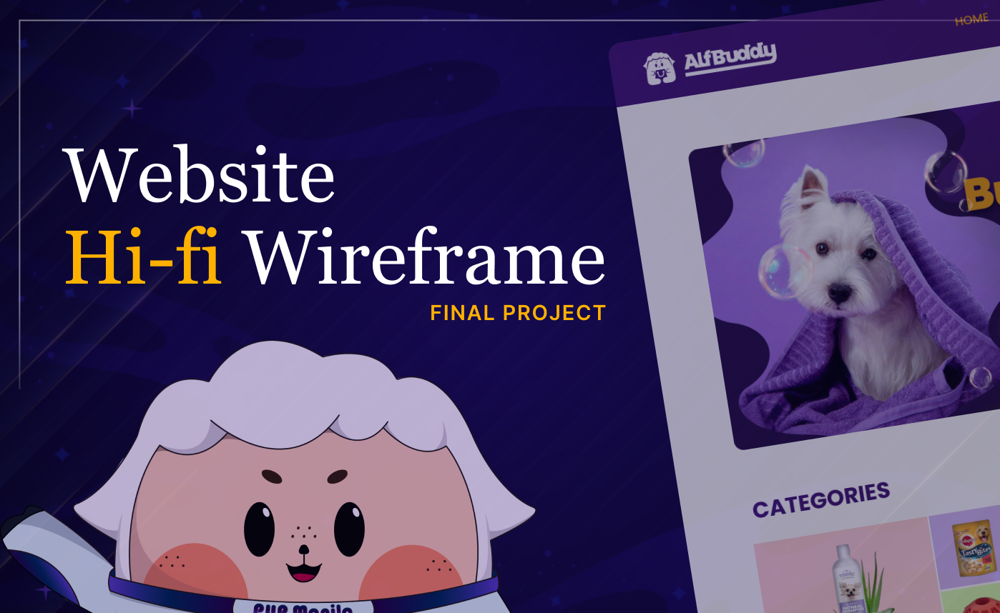

**<h1 align="center"> DAY 15: Navigation </h1>**
**CONGRATULATIONS** for making it to our final project! We hope you learned a lot from our previous lessons and workshops~

Now it's time to create a high-fidelity layout of low-fidelity you've made during the last activity.

## Building Hi-Fi Wireframes

Creating high fidelity wireframes is similar to designing a real website. It's like building a website **without coding** it!

The key difference between low-fidelity and high-fidelity wireframes is that **lo-fi** represents design direction and general layout while the **hi-fi is well-researched** and presents a more precise look and functionality of the future product.

The common development phase usually consists of:

The last part of the design phase is building the **HI-FI** layout. This is done to help teams validate the final product design, and avoid tricky fixes during the development process.

-   **Translating lo-fi to hi-fi**:
    > Guide: [**_Lo-fi to Hi-fi Wireframe Tutorial_**](https://www.youtube.com/watch?v=UU_eyUGWIEI)

Your task for the whole duration of Week 3 is to build an improved version of AlfBuddy's Website! So reflect on your learnings in Week 1 - 2 and let's start building projects🚀

## **About the Challenge:**

For Day 15, let's take things slowly and start by building the navigation bar!

**Guidelines:**  

-   **Introduction:** Understand how high fidelity wireframe works

-   **Practical Exercises:** Design a navigation bar for Alfbuddy. Create interactive prototypes to test navigation usability. _(Prototype is optional)_

    -   Learn More: [Rules when creating a navigation bar](https://bootcamp.uxdesign.cc/smooth-navigation-captivating-experience-a-ui-ux-design-guide-for-effective-layout-and-navigation-d7e20386f73a)

**<h3>Situation</h3>**

Navigating the recently launched AlfBuddy e-commerce website turned into a frustrating experience for users as the navigation’s icons were too messy and it failed to seamlessly translate into the live site. You've been assigned the exciting task of crafting a navigation masterpiece in Figma!

### ✅ To-Do List

-   Fix the layout for the icons in the navigation
-   Make it more user-friendly and easier to navigate by changing its layout
-   Experiment with different spacing techniques and font styles
-   Utilize Figma’s microinteraction features to add subtle animations or transitions

 
This challenge is perfect for individuals with some development experience who want to explore the latest trends in crafting seamless navigation experiences.
  

**<h3>Instructions</h3>**

You are tasked to create an **improved version** of AlfBuddy's old website and showcase it using high fidelity wireframe. Let's start by redesigning ALfBuddy's navigation bar to enhance user experience and streamline access to key features~

> Visit <a href="" target="_blank">Week 3 [Day 15-22] : Hi-Fi Wireframe Website</a> in new tab and click on [**Open in Figma**].

 

&nbsp;&nbsp;&nbsp;&nbsp;**Day 15: Navigation** 

-   Read the instructions inside the Figma file.
-   Explore AlfBuddy's website and take a look at its navigation bar. Pay attention to the overall user experience, accessibility, and efficiency of the navigation, and identify any potential areas for improvement, such as clarity of menu labels, ease of finding key sections, or its layout using the C.R.A.P. design principles.
-   Proceed to redesign its navigation bar, referencing the **lo-fi wireframe layout** you have created on **days 12-14**.
      

**<h3>Show off your work!</h3>**

submit your work here _(just paste the link of the figma file you've made)_ : <a href ="../../submissions/final-projects/day15-22.md" target="_blank">../../submissions/final-projects/day15-22.md</a>

## Resources

> <a href="https://youtu.be/NWePUZJr9fM?si=O2n00NO6N3uqP484" target="_blank">Responsive Navigation Bar in Figma - How to Design Auto Layout Navbar </a>

> <a href="https://dev.to/raoufbelakhdar/figma-tutorial-how-to-create-a-responsive-navigation-menu-43nn" target="_blank">Figma Tutorial- How to Create a Responsive Navigation Menu</a>
