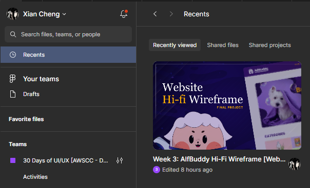

**<h1 align="center"> DAY 18: Best Sellers </h1>**
**"Discover the design magic everyone's talking about – are you ready to elevate your projects with our Figma best sellers?"**

Showcasing best sellers is vital for businesses, serving as a potent marketing tool that builds trust and streamlines the decision-making process for customers. To design an engaging best sellers section, visual elements like badges and clear categorization enhance user experience. Equally crucial is incorporating user feedback, leveraging customer reviews to provide authenticity and inform ongoing design decisions for continuous improvement. This dynamic approach not only highlights top-performing products but also fosters a sense of community and credibility around them.

_**Check the Resources at the end of this README for more guides**_

## **About the Challenge:**

**<h3>Situation</h3>**

In AlfBuddy, the pet product online store, the "Best Sellers" section is missing some important things. There's no heart icon for a wishlist, and it's not clear how to add things to the cart. Also, we're not seeing how much is left in stock or how many reviews each product has. This makes it hard for people to show interest or make quick decisions. By fixing these things, AlfBuddy can make it easier for users, keep them happy, and maybe even sell more products. It's like making sure the favorite products are saved, making it simple to buy them, and showing how popular and available they are. This way, shopping for pet products becomes way better for everyone.

### ✅ To-Do List

-   Enhance wishlist engagement
-   Implement a discreet button alongside each product
-   Display the remaining stock of popular products prominently
-   Include numbers of reviews for each product
  

**<h3> 📋 Instructions</h3>**

You are tasked to create an **improved version** of AlfBuddy's old website and showcase it using high fidelity wireframe. Continue the initiated improvement process by redesigning its best sellers section~

> Go to your duplicated file of **Week 3 [Day 15-22] Hi-Fi Wireframe Website** and continue where you have left off.

&nbsp;&nbsp;&nbsp;&nbsp;&nbsp;&nbsp;&nbsp;&nbsp;
 

&nbsp;&nbsp;&nbsp;&nbsp;**Day 18: Best Sellers** 

-   Read the instructions inside the Figma file.
-   Continue exploring AlfBuddy's website and navigate to its best sellers section. Evaluate the arrangement and design of this segment. Consider potential enhancements that could elevate the overall engagement and satisfaction when exploring the best sellers offerings.
-   Proceed to redesign its best sellers section, referencing the **lo-fi wireframe layout** you have created on **days 12-14**.
      

**<h3>Show off your work!</h3>**

submit your work here _(just paste the link of the figma file you've made)_ : <a href ="../../submissions/final-projects/day15-22.md" target="_blank">../../submissions/final-projects/day15-22.md</a>

## Resources

> <a href="https://youtu.be/x-0wm2AFri0" target="_blank">Amazing E-Commerce Website UI Design in Figma | Online Shop Website Design </a>

> <a href="https://webdesigner.news.blog/2019/05/28/tips-for-showcasing-best-seller-products/" target="_blank">Top Tips For Showcasing Your Best Seller Products in e-Stores</a>
