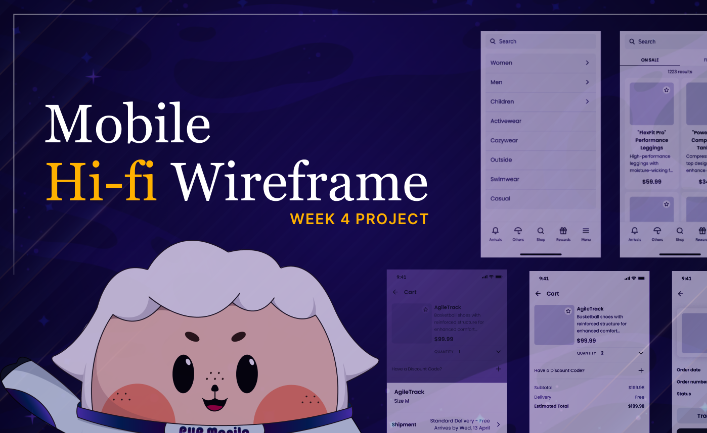

**<h1 align="center"> DAY 23: Navigation [Mobile]</h1>**
**Congratulations on finishing your hi-fi wireframe for AlfBuddy's website! Now let's learn all about website responsiveness!**

## Website Responsiveness Design

Have you ever noticed how a website's layout changes everytime you're on different devices? That's because of **Website Responsiveness**! As screen sizes becomes smaller, the layout of the website will adjust to fit its content to the screen.

**_Why is it important?_**

-   It ensures that your website or application is **accessible to users on all devices**. This is important because majority of people are using their smartphones and tablets to access the web.
-   It **improves the user experience** by making it easier for users to interact with your website or application on different devices.
-   Eliminates the need to create separate websites for different devices.

**_Learn More:_**

> [**Guide to Responsive Web Design** _(article)_](https://bootcamp.uxdesign.cc/responsive-across-all-devices-an-incredible-guide-to-responsive-ui-ux-design-7d710eddc9c8)

## About the Challenge:

**Creating AlfBuddy's Mobile Navigation**  
_Are you a map? Because navigating through life with you feels like a delightful adventure in every click...˶ᵔ ᵕ ᵔ˶_

In the final week of our UX Research Workshop, the focus shifts to ensuring a seamless experience across all devices. With the hi-fi wireframe for AlfBuddy's redesigned website in hand, your task today is to translate this vision into a mobile-friendly format. As users increasingly access websites on various devices, website responsiveness is improtant.

Drawing on design principles and considering the specifics of mobile user interactions, your goal is to create a hi-fi wireframe that maintains the integrity of the user experience, regardless of the screen size. This marks the culmination of our week-long journey, transforming AlfBuddy into a pet shopping destination that's both intuitive and accessible.

## 📋 Instructions

You are tasked to create a **mobile version** of the NAVIGATION from the hi-fi wireframe layout you made on **days 15-22**. This will help you know more about responsive UI/UX design and translating your designs into different screen sizes.

> Visit <a href="" target="_blank">Week 4 : Hi-Fi Wireframe Mobile</a> and click on [**Open in Figma**].

-   Read the instructions inside the Figma file.
-   Create a **mobile version** of the NAVIGATION BAR from the hi-fi wireframe layout you made on **days 15-22 [Week 3]**
-   Traslate your design in Week 3 to make it fit to a smaller screen size
      

**<h3>Show off your work!</h3>**

Submit your work here _(just paste the link of the figma file you've made)_ : <a href ="../../submissions/final-projects/day23-30.md" target="_blank">../../submissions/final-projects/day23-30.md</a>

## Resources

> <a href="https://www.youtube.com/watch?v=5XZ-X5ewo9c" target="_blank">Create an Interactive App Navigation Menu in Figma</a>

> <a href="https://www.smashingmagazine.com/2022/11/navigation-design-mobile-ux/" target="_blank">Designing Navigation for Mobile: Design Patterns and Best Practices/</a>

> <a href="https://www.smashingmagazine.com/2016/11/the-golden-rules-of-mobile-navigation-design/" target="_blank">The Golden Rules Of Bottom Navigation Design</a>

> <a href="https://www.figma.com/file/RoMOqYB1g8EBHPcxDlqLmP/Mobile-Navigation-Menu-Bar-%7C-Bottom-Navbar-(Community)?type=design&node-id=0-1&mode=design&t=ELZRvAActDJln21E-0" target="_blank">Mobile Navigation Bar</a>
