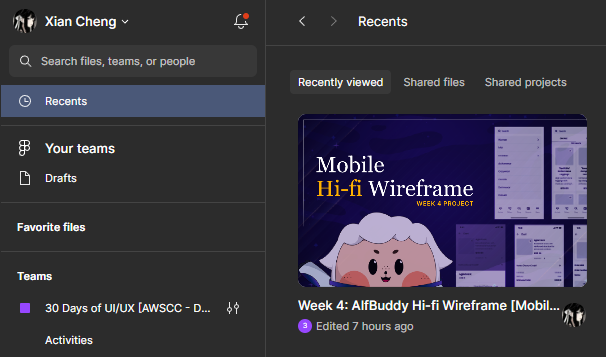

**<h1 align="center"> DAY 26: Best Sellers</h1>**
**_How does the best seller keep calm during a website crash? It practices "best-seller-f-care"!_ ૮꒰ ˶• ༝ •˶꒱ა ♡...**

Okay, imagine when your favorite game or snack is right at the front of the store, catching your eye - that's showcasing best sellers! It's like a store's way of saying, "Hey, check these out! They're super cool and lots of people love them." So, if you see a special section or a big online banner shouting about "Best Sellers," it's like a spotlight on the coolest stuff they've got.

Showcasing best sellers in mobile design using Figma is an important strategy to enhance user engagement and drive sales. Let's delve into the reasons behind the importance of featuring best-selling products, followed by a description of how this can be effectively achieved in Figma for mobile design. But firstly, let's have the guidelines!

## **About the Challenge:**

You are tasked to create the **mobile version** of the **BEST SELLERS** based on the hi-fi wireframe you made on **days 15-22**. This will help you know more about responsive UI/UX design and translating your designs into different screen sizes.

### 📋 Instructions

> Go to your duplicated file of **Week 4: AlfBuddy Hi-Fi Wireframe [Mobile]** and continue where you have left off.

&nbsp;&nbsp;&nbsp;&nbsp;&nbsp;&nbsp;&nbsp;&nbsp;
 

-   Create a **mobile version** of the BEST SELLERS from the hi-fi wireframe layout you made on **days 15-22 [Week 3]**

## Show off your work!

submit your work here _(just paste the link of the figma file you've made)_ : <a href ="../../submissions/final-projects/day23-30.md" target="_blank">../../submissions/final-projects/day23-30.md</a>

## Resources

> <a href="https://www.roihunter.com/blog/scaling-e-commerce-revenue-with-bestsellers" target="_blank">Scaling E-Commerce Revenue With Bestsellers</a>

> <a href="https://www.cleverreach.com/en-de/push-magazin/email-marketing-strategy-tips/how-the-bestseller-effect-increases-your-sales-sales-psychology-meets-email-marketing-part-6/" target="_blank">How the Bestseller Effect Increases Your Sales </a>
